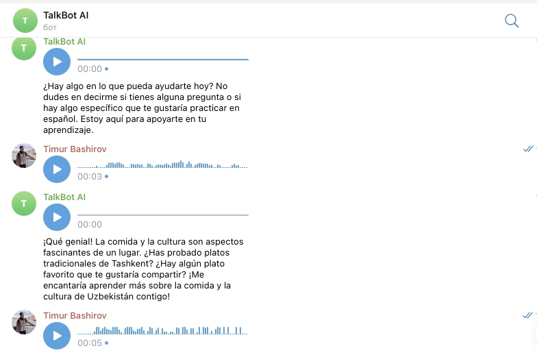

Project Overview
This project is a Telegram bot built with Java, capable of engaging in voice conversations with users. The bot can understand spoken input, generate voice responses, and maintain natural conversations. Additionally, the bot can assist users in language learning by providing interactive dialogue practice.

Note: The project is currently under development.

Features
Voice Recognition: The bot listens to and understands human speech through voice input.
Voice Response: It generates and sends voice responses to engage in conversation.
Conversational AI: The bot can maintain a natural conversation with users.
Language Learning Support: The bot can assist in practicing and learning new languages through voice-based interactions.

